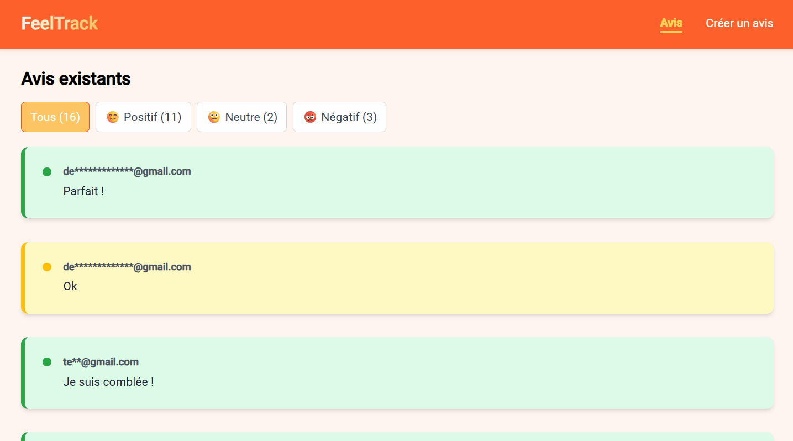
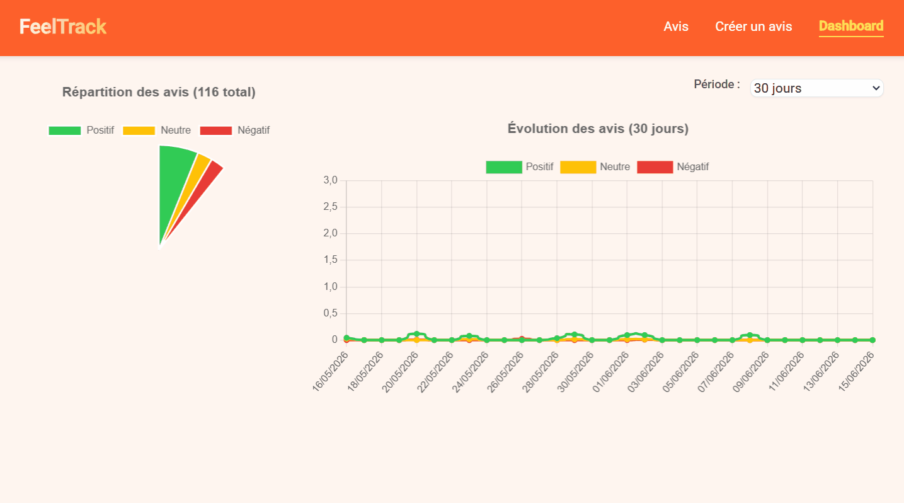

# FeelTrack

Frontend de l’application full stack FeelTrack (Angular + Spring Boot).

## 🚀 Démo en ligne

🌐 https://feeltrack-frontend.vercel.app

> **Note :**
> Le backend est hébergé sur l'offre gratuite de Render. Après une période d'inactivité, le premier chargement peut prendre 1 à 2 minutes en raison d'un cold start. Une fois le serveur démarré, l'application fonctionne normalement.


## 📋 Table des matières

- [À propos](#à-propos)
- [Démonstrations](#démonstrations)
- [Prérequis](#prérequis)
- [Installation](#installation)
- [Utilisation](#utilisation)
- [Structure du projet](#structure-du-projet)
- [Technologies](#technologies)
- [Scripts disponibles](#scripts-disponibles)
- [Contribution](#contribution)

## À propos

**FeelTrack** est une application full stack permettant de collecter, analyser et visualiser des avis utilisateurs. Chaque avis est automatiquement classé par sentiment (positif, neutre ou négatif), puis présenté dans un tableau de bord interactif permettant d'identifier rapidement les tendances. 
Le projet utilise une architecture orientée fonctionnalités avec Angular 21 et des composants autonomes (standalone components).

> **ℹ️ Note** : Il s'agit de l'application **frontend** de FeelTrack. Elle communique avec le backend disponible à : [github.com/Cherrygolo/sa-backend](https://github.com/Cherrygolo/sa-backend)

### Analyse des avis

Le dashboard fournit une vue synthétique de l'activité grâce à :

- une répartition des sentiments (positif, neutre, négatif),
- une visualisation de l'évolution des avis dans le temps,
- une adaptation automatique de l'affichage selon la période sélectionnée.

Ces visualisations permettent d'identifier rapidement les tendances et d'évaluer la perception globale des utilisateurs.

### Fonctionnalités principales
- 📝 Création d'avis avec formulaire intuitif
- 📋 Affichage d'une liste d'avis filtrable par type (positif / négatif / neutre)
- 🎨 Interface responsive et moderne, utilisant SCSS et TailwindCSS
- 🔄 Gestion d'état réactive avec RxJS
- 📊 Dashboard analytique avec visualisation des tendances et de la répartition des sentiments
- 🔌 Communication avec l'API backend

### 📊 Dashboard analytique

- 📉 Visualisation de la répartition des avis par sentiment via un graphique en camembert (Chart.js / ng2-charts)
- 📈 Suivi de l'évolution temporelle des avis avec un graphique de tendance
- 🧠 Agrégation intelligente des données selon la période sélectionnée
- 🏷️ Formatage dynamique des périodes (jour, semaine, mois) pour une meilleure lisibilité
- 🎯 Analyse rapide des tendances et de la distribution des sentiments
- 🔄 Gestion robuste des erreurs avec mécanisme de retry automatique lors du chargement des données
- 📱 Affichage responsive adapté aux différentes tailles d'écran

## Démonstrations

### Consultation des avis avec filtrage par type


### Création d’un avis


### Dashboard analytique


## Prérequis

Avant de commencer, assurez-vous d'avoir installé :

- **Node.js** version 20+ (inclus npm 11+)
- **Angular CLI** version 21.1.4+ : `npm install -g @angular/cli@21`

Vérifiez vos installations :
```bash
node --version    # v20.x.x ou supérieur
npm --version     # 11.x.x ou supérieur
ng version        # Angular CLI: 21.1.4
```


## Installation

1. **Cloner le repository** (ou extraire le projet)
```bash
cd feel-track
```

2. **Installer les dépendances**
```bash
npm install
```

## Utilisation

### Démarrer le serveur de développement

```bash
npm start
```

ou directement :
```bash
ng serve
```

Le serveur démarre à `http://localhost:4200/`. L'application se rechargera automatiquement lors de modifications des fichiers source.

### Générer un nouveau composant

```bash
ng generate component nom-du-composant
```

Pour plus d'options :
```bash
ng generate --help
```

### Compiler pour la production

```bash
npm run build
```

Les artefacts compilés seront stockés dans le répertoire `dist/`. La compilation optimise automatiquement l'application pour les performances.

### Exécuter les tests unitaires

```bash
npm test
```

La suite de tests utilise [Vitest](https://vitest.dev/) comme test runner.

### Mode watch pour le développement

```bash
npm run watch
```

Recompile l'application à chaque modification en mode développement.

## 📁 Structure du projet

```
src/
├── app/
│   ├── app.config.ts          # Configuration globale de l'application
│   ├── app.ts                 # Composant racine (root component)
│   ├── app.routes.ts          # Routes de l'application
│   ├── app.html               # Template du composant racine
│   ├── app.scss               # Styles globaux du composant
│   │
│   ├── core/                  # Services et logique métier
│   ├── layout/                # Composants de mise en page
│   │   └── main-layout/       # Layout principal
│   │
│   ├── features/              # Fonctionnalités métier
│   │   └── reviews/           # Module des avis
│   │       ├── review.routes.ts
│   │       ├── components/    # Composants réutilisables
│   │       │   └── review-card/
│   │       │
│   │       ├── mappers/       # Transformation DTO <-> Model
│   │       ├── models/        # Interfaces / types liés au domaine
│   │       ├── pages/         # Pages métier
│   │       │   ├── review-list/
│   │       │   └── review-creation-form/
│   │       └── services/      # Logique d'accès aux données / API
│   │           └── review.service.ts
│   │
│   └── shared/                # Composants et services partagés
│
├── styles/                    # Styles globaux réutilisables
│
├── main.ts                    # Point d'entrée de l'application
├── index.html                 # Fichier HTML principal
└── styles.scss                # Styles globaux
```

### Conventions de nommage

- **Composants** : `kebab-case` (ex: `review-card.component.ts`)
- **Dossiers** : `kebab-case` (ex: `review-list/`)
- **Classes** : `PascalCase` (ex: `ReviewCardComponent`)
- **Variables/Functions** : `camelCase` (ex: `onReviewSubmit()`)

## 🛠️ Technologies

| Technologie | Version | Usage |
|-----------|---------|-------|
| **Angular** | 21.1.0 | Framework principal |
| **TypeScript** | ~5.9.2 | Langage de programmation |
| **RxJS** | ~7.8.0 | Programmation réactive |
| **SCSS** | - | Préprocesseur CSS |
| **Chart.js** | 4.x | Visualisation des données (dashboard analytics) |
| **ng2-charts** | - | Intégration Angular de Chart.js |
| **TailwindCSS** | 3.4 | Utilitaires CSS rapides avec thème personnalisable
| **Vitest** | - | Framework de test |
| **Prettier** | - | Formatteur de code |

## 🏗️ Architecture

### Frontend-Backend

Cette application frontend communique avec le backend FeelTrack pour gérer les avis disponibles à :

**[Backend FeelTrack](https://github.com/Cherrygolo/sa-backend)**

Le frontend envoie des requêtes HTTP vers l'API backend pour :
- Récupérer la liste des avis existants
- Créer de nouveaux avis
- Récupérer des statistiques sur les avis existants

Assurez-vous que le serveur backend est en cours d'exécution pour que l'application fonctionne correctement.

## 📝 Scripts disponibles

| Commande | Description |
|----------|------------|
| `npm start` | Lance le serveur de développement |
| `npm run build` | Compile pour la production |
| `npm run watch` | Compile en mode watch |
| `npm test` | Exécute les tests unitaires |
| `npm run ng` | Accès direct à Angular CLI |

## 📐 Configuration

### Prettier

Le projet utilise **Prettier** pour la formatting du code avec les paramètres suivants :
- Largeur de ligne : 100 caractères
- Guillemets simples
- Parser Angular pour les fichiers HTML

### Angular CLI

Schematics configurés dans `angular.json` :
- Style : **SCSS**
- Tests : Désactivés par défaut (à activer manuellement)

### Standards de code

- Suivre les conventions de nommage indiquées ci-dessus
- Respecter la structure modulaire du projet
- Ajouter des tests unitaires pour les nouvelles fonctionnalités
- Utiliser `ng generate` pour créer les nouveaux éléments
- Formater le code avec Prettier
